#  Cricket Management System

A full-stack Cricket Management System developed using **Flutter**, **Node.js (Express)**, and **PostgreSQL**. The application helps manage cricket teams, players, matches, live scoring, batting & bowling records, and match results through an easy-to-use interface.

##  Features

- Team Management
- Player Management
- Match Scheduling & Management
- Live Score Management
- Batting & Bowling Records
- Match Scorecard
- Match Result Generation
- Tournament Setup
- Dashboard with Statistics

---

##  Tech Stack

- **Frontend:** Flutter
- **Backend:** Node.js + Express
- **Database:** PostgreSQL


---

#  Project Screenshots

| Dashboard | Team Management |
|------------|-----------------|
| 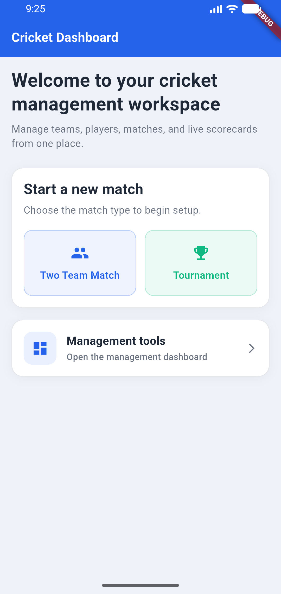 | 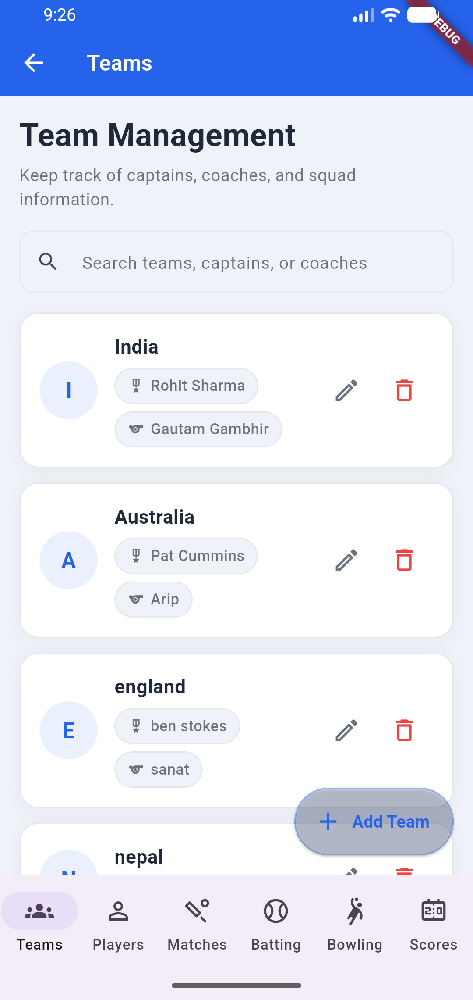 |

| Player Management | Match Management |
|-------------------|------------------|
| 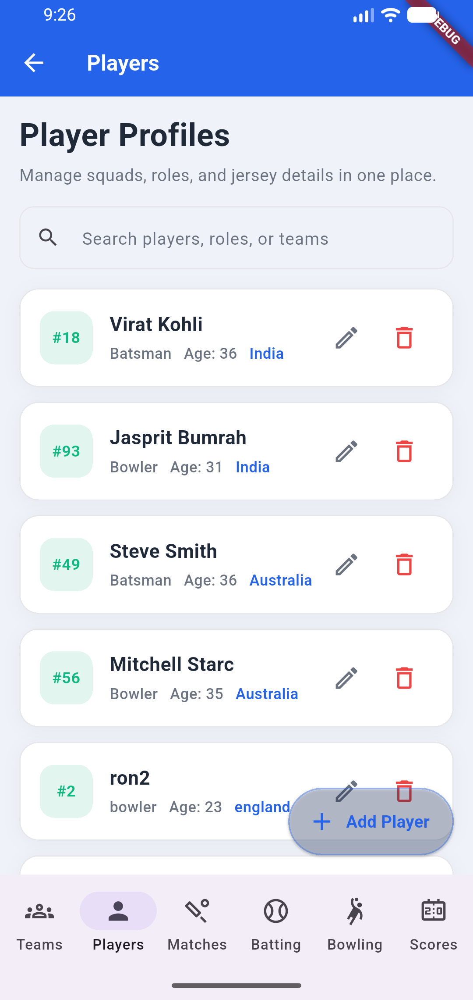 | 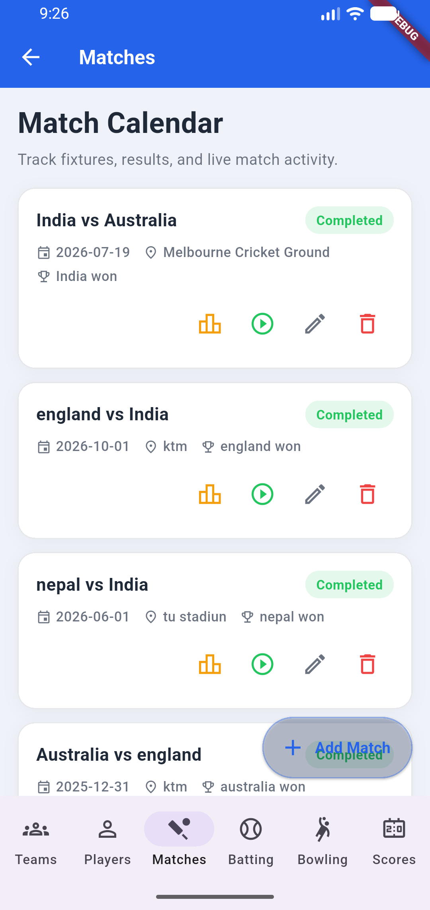 |

| Live Score | Match Result |
|------------|--------------|
| 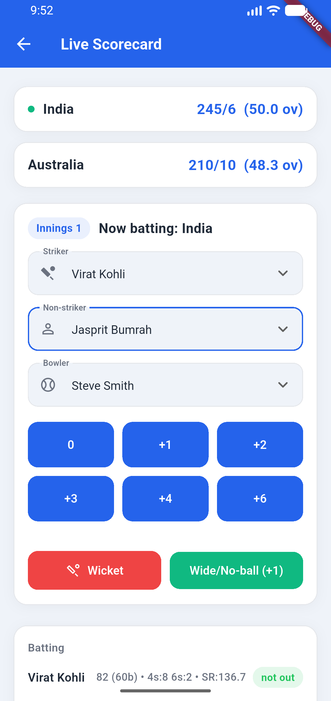 | 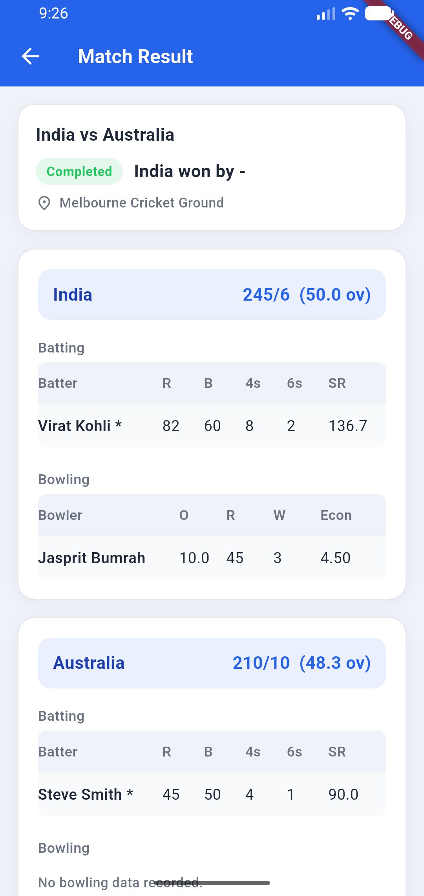 |

| Batting Record | Bowling Record |
|----------------|----------------|
| 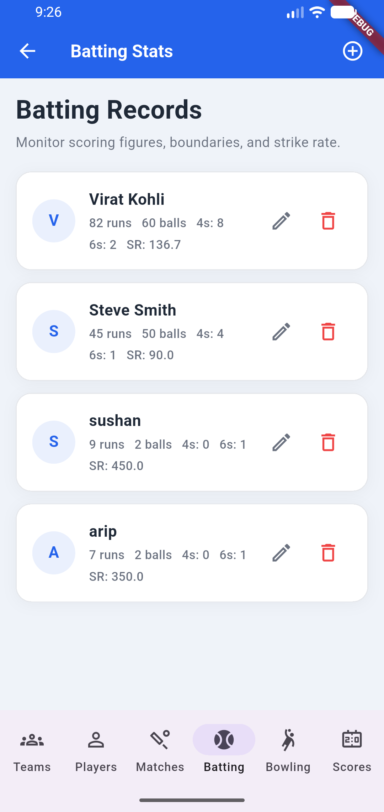 | 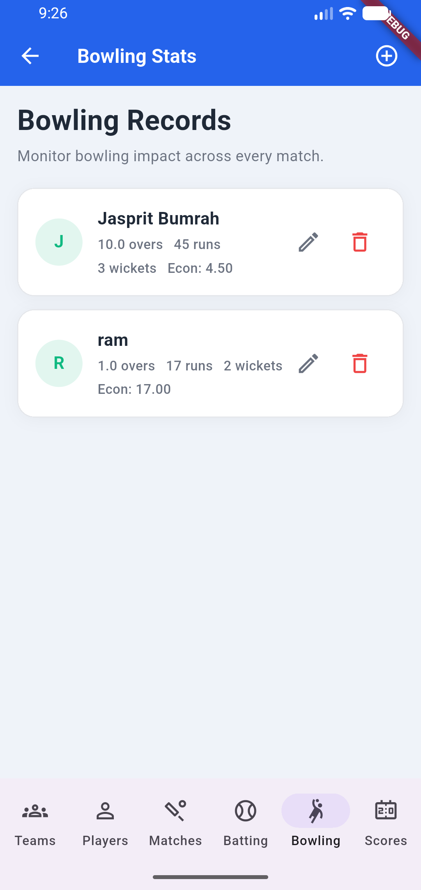 |

| Result Scorecard | Match Score |
|------------------|-------------|
| 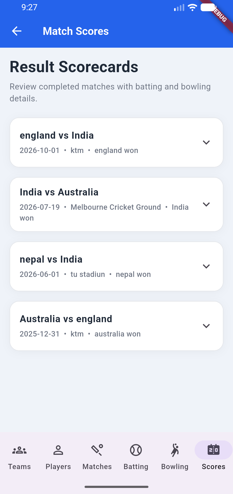 | 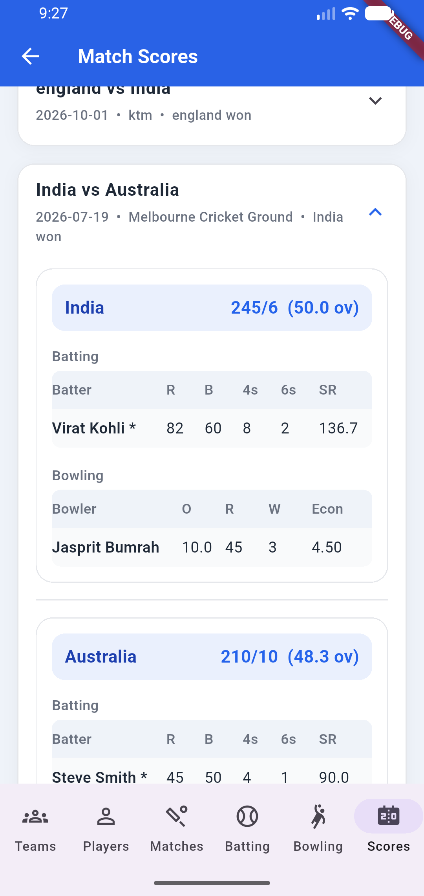 |

| Edit Player | Tournament Setup |
|-------------|------------------|
| 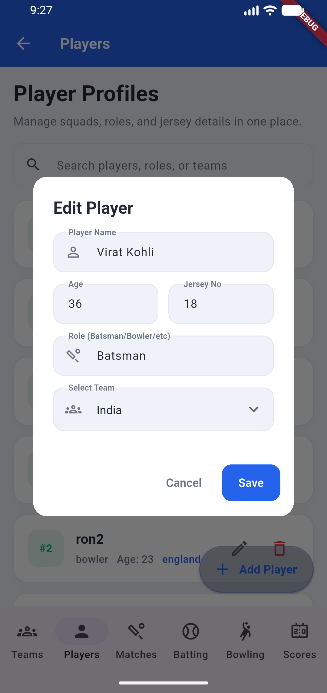 | 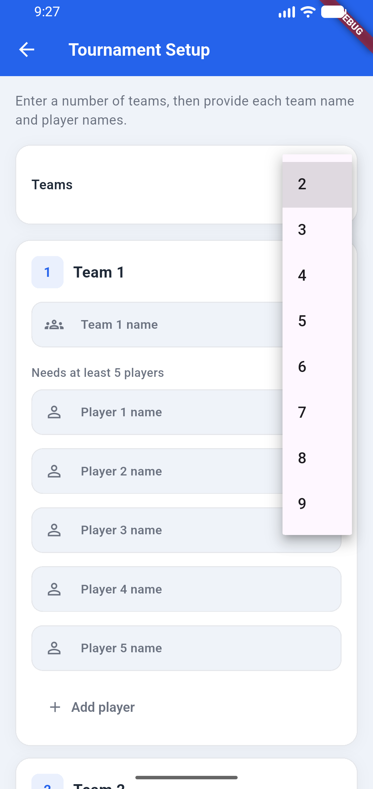 |

---

##  How to Run

### Backend

```bash
cd cricket-backend
npm install
npm start
```

### Frontend

```bash
cd cricket_app
flutter pub get
flutter run
```

---

##  Project Assets

All project assets, documentation, database dump, and additional resources are available here:

###  **Google Drive**
**https://drive.google.com/drive/folders/1-wYE4ySBqJpwqSooDm5AzBPD1LjK8BQL**


---

##  Developed By

**Bandana Gyawali**  
**Arip Sunar**  
**Sanat Giri**  
**Sushan Luitel**  
Computer Engineering Students
Kathmandu University